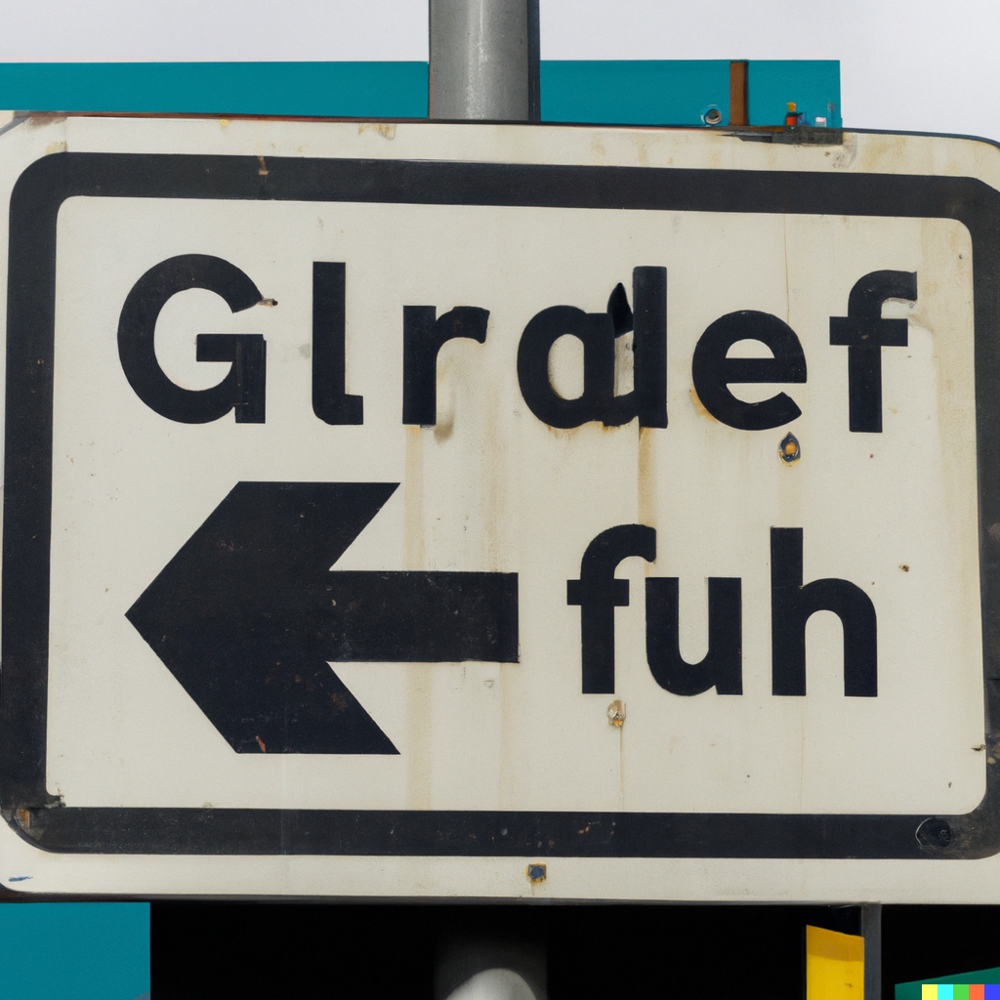
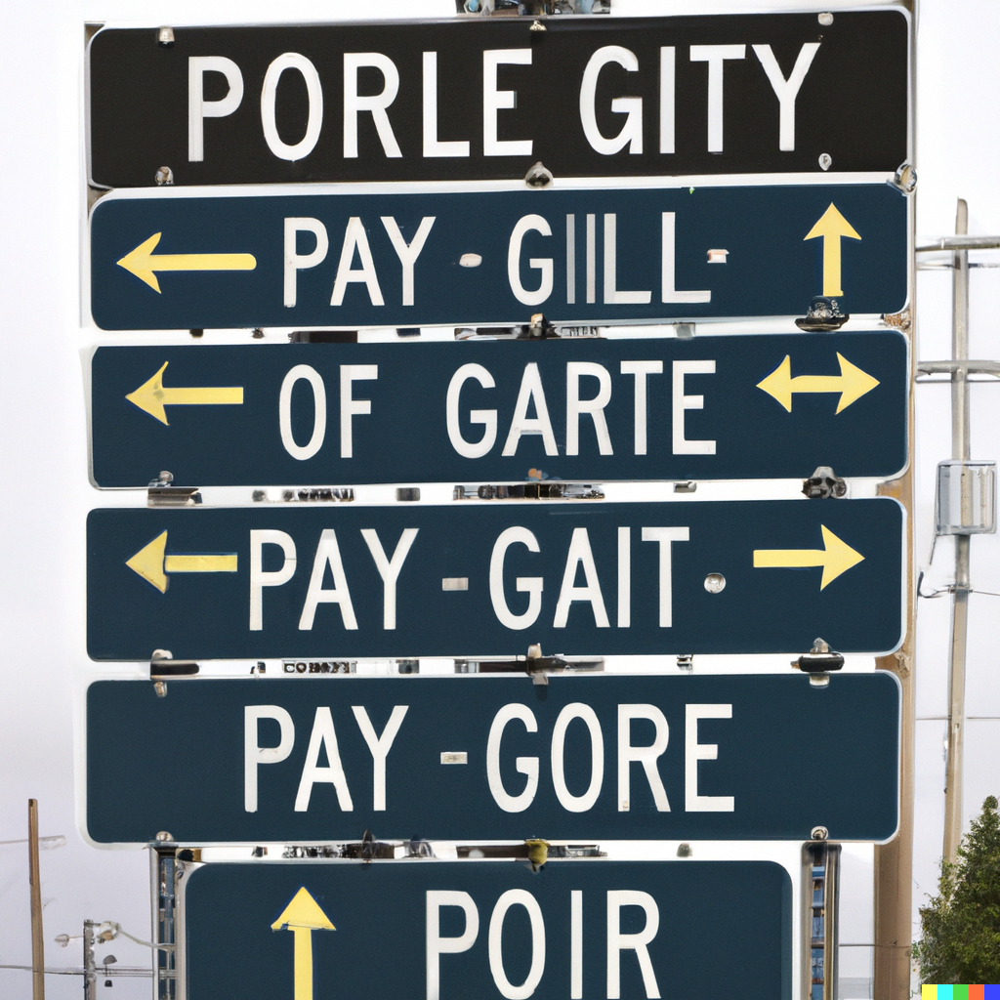
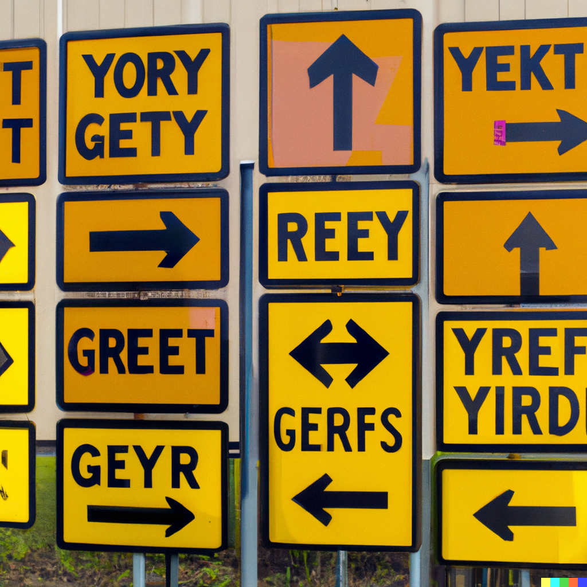
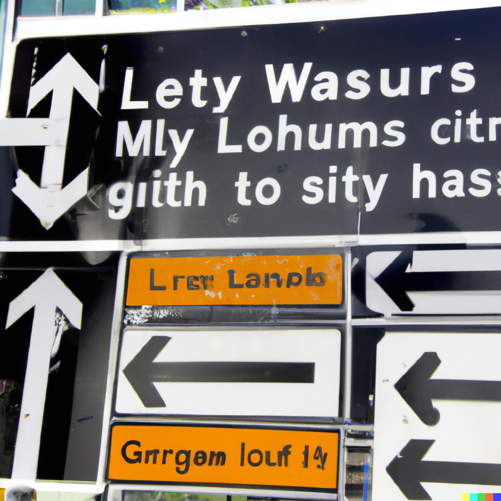
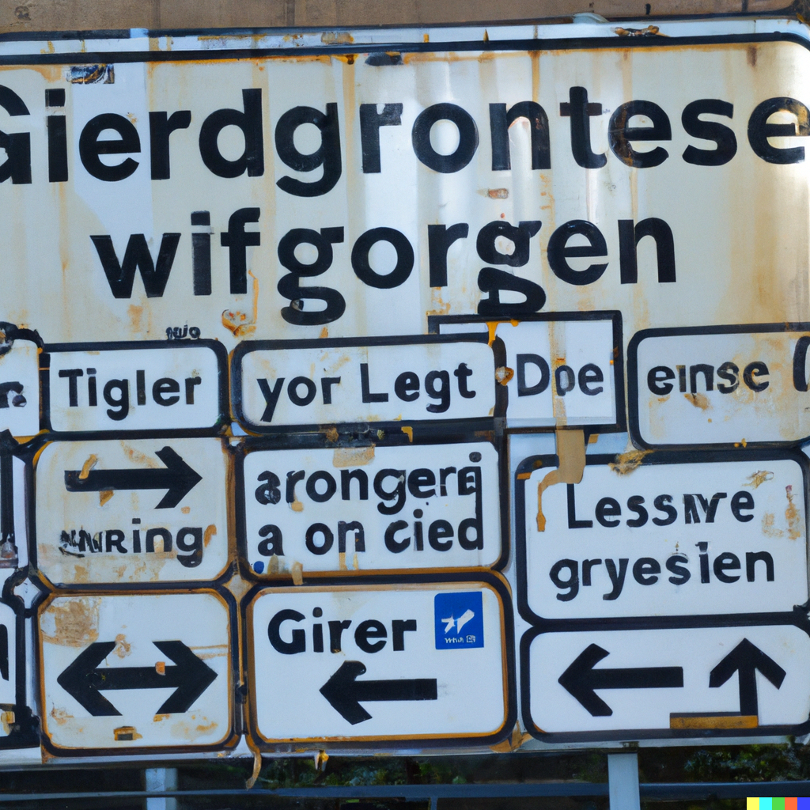
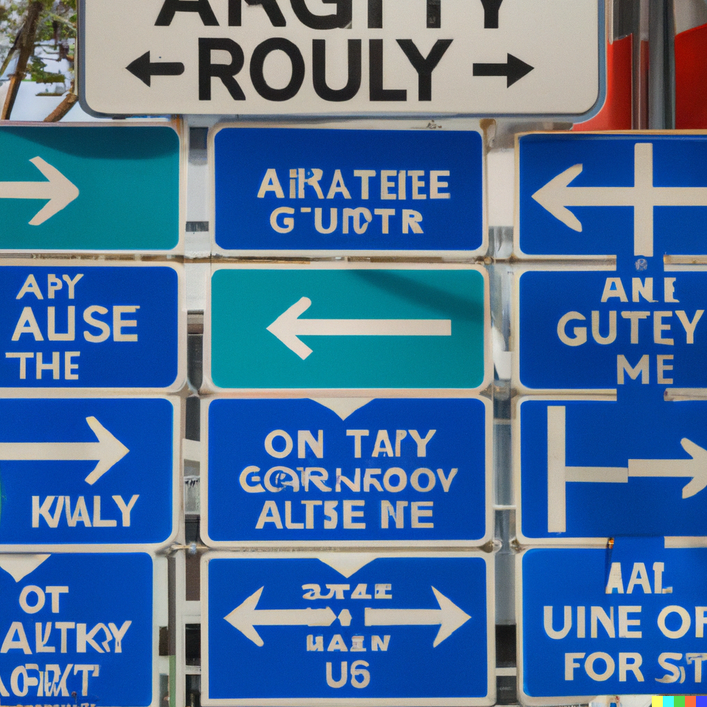
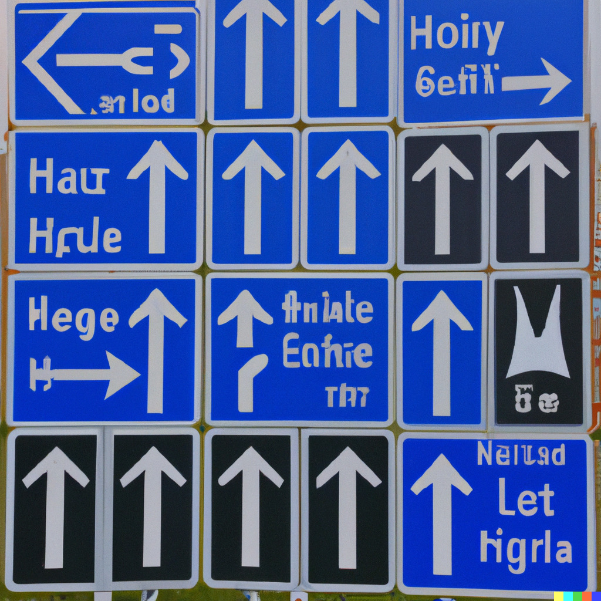
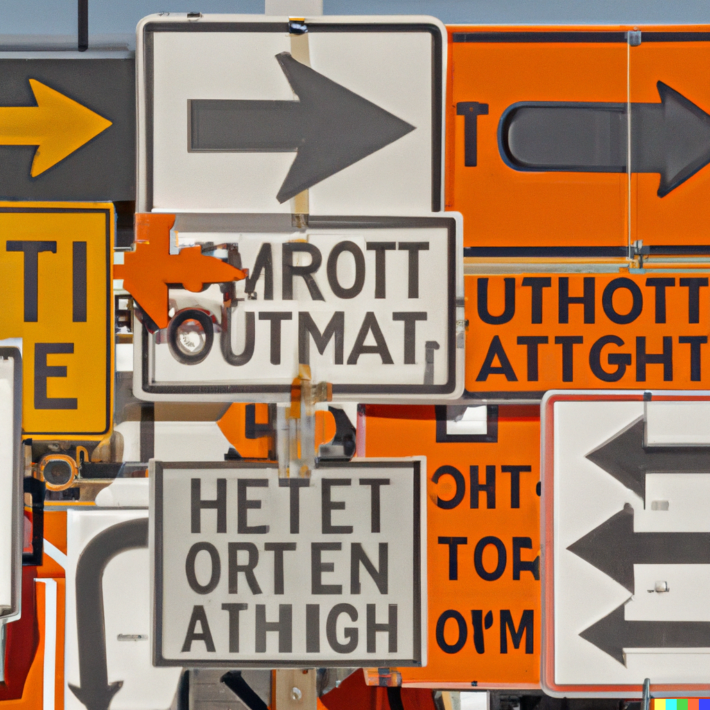
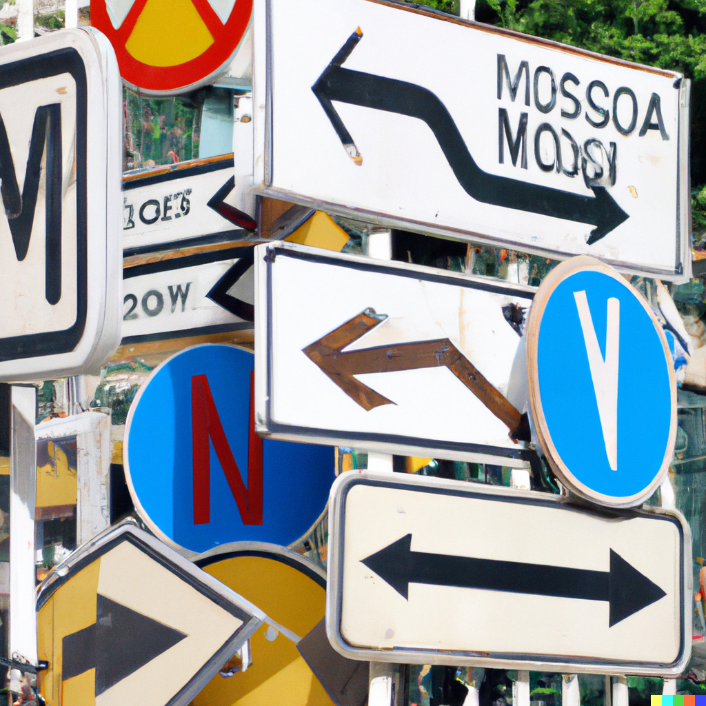
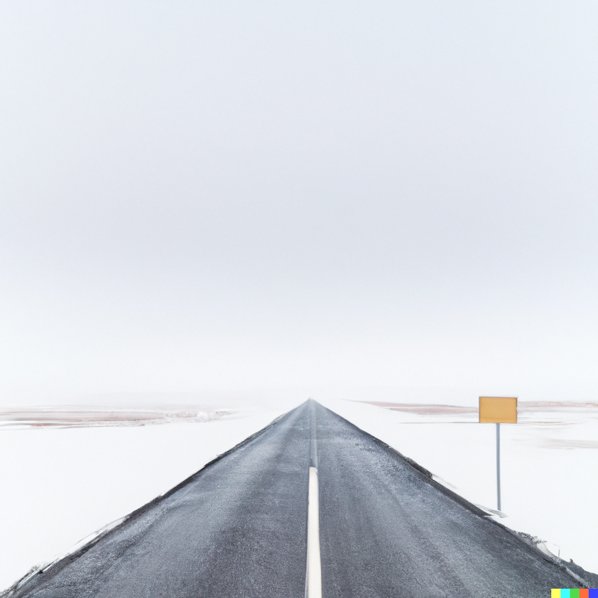

# tserk -- цирк(овь)

**When I do not know where to go**, I follow the sign. This is simple, because there is one direction I can go: the direction the sign points in. It does not matter if I do not know where I will go. Thank you, sign, for guiding me when I do not know how to guide myself. But this is a naive state of the world. Perhaps it is even one which never existed at all, except in the nostalgic past of present minds.

 

 

There are two signs pointing in different directions. Where should I go? I need to know where I am going. If I go in one direction, I will not be going in another. Directions do not direct us towards places, but rather away from other directions. Directionality is a recursive, absolutely negative entanglement. And here I stand, entangled. But I am not unfree. I experience my most radical moment of freedom at this juncture. How sweet and precious it is. I am my own determiner. I choose where I am going. How beautiful it is. How anxious it is. How nervous my freedom makes me. I do not think I like this freedom very much. Please do not make me choose, because I have just realized that I am illiterate. I am incompetent. I cannot read. Please teach me how to read, so I can understand the sign, and allow the sign to determine me. Please liberate me from my freedom. 

 

 

I need to go in both directions to arrive home. I want to go here but I need to go both there and there, together. This is confusing. But it is not anxious. It does not matter that I am illiterate. It is a logical confusion. So I stand here and look at the signs -- pretending I know what they mean, but not telling anyone else that I have given up long ago. I am happy. After a long time, I realize that the signs have been pointing to myself. I was home all along.

 

 

Sometimes I come across ordered signs at street intersections in the cities. They form grids, arrays -- pixels in a frozen screen. They are quite flat: they have no dimension. But they certainly have directions, even if they are messy ones. I follow one direction, but it points me towards another which moves me in a different direction. I stand in front of the assemblage and spasm my body until it is too tired, and then I search for the next assemblage.

 

 

I can't read the signs. No one else can, either. Most people, that is. The signs aren't there to be read. You're supposed to see them and go where it says to go. Everyone knows that. Most people, that is.

 

 

The Reaksonïa insist that if everyone learned to read like they could, that we wouldn't have so much difficulty getting around. If I learnt how to read, they said, I could look at the signs and choose the one which would take me where I wanted to go. And I could just go. But I don't know where I want to go to begin with. And I don't believe that the Reaksonïa really know how to read the signs at all.

 

 

The Stroïtel writes and puts up all of the signs. That's Her job. She creates all of the signs in Tserk. 

 

 

I think the Stroïtel knows that no one can read. That's why She creates them, so She can help guide us through space.

 

 

I know where to go. I follow the signs. This is simple, because there is one direction I can go: the direction the signs points towards. It does not matter if I do not know where I will go. Thank you, Stroïtel, for guiding me when I do not know how to guide myself, which is always. I don't even have to look at what you say to know what you want me to do. And I am more than happy to oblige.

 

 

This is confusing. These signs are curved and twisted. They have depth. They are more disorienting, because they beckon me with a new orientation: within and into, not around and about. The directions here do not point us away from other directions, like the gridded signs do, even if they appear like they do, because the fabric of their directionality bends inwards. I pause. Where should I go?

 

 

I step into the signs.

When I step out, I stand on a blank road with a blank sign. I don't know where to go, but I feel that I am beginning to learn how to read.

 

 

---

Context.  
All images generated by the generative discrete variational autoencoder model introduced by <a href="https://arxiv.org/pdf/2102.12092.pdf">Ramesh et al.</a> from OpenAI, better known as DALL-E. Prompts used for generating the images asked the model to draw traffic signs with text with quantifier modifiers as necessary, while leaving specific configurations variable. The text, in particular, reflects the model's visual experience of human language in the world we inhabit: an understanding which is in some sense presymbolic after the symbolic.
Цирк ("tserk") is Russian for circus. Церковь ("tserkovf") is Russian for church. Стройтель ("stroh-ee-tel") is Russian for builder.

