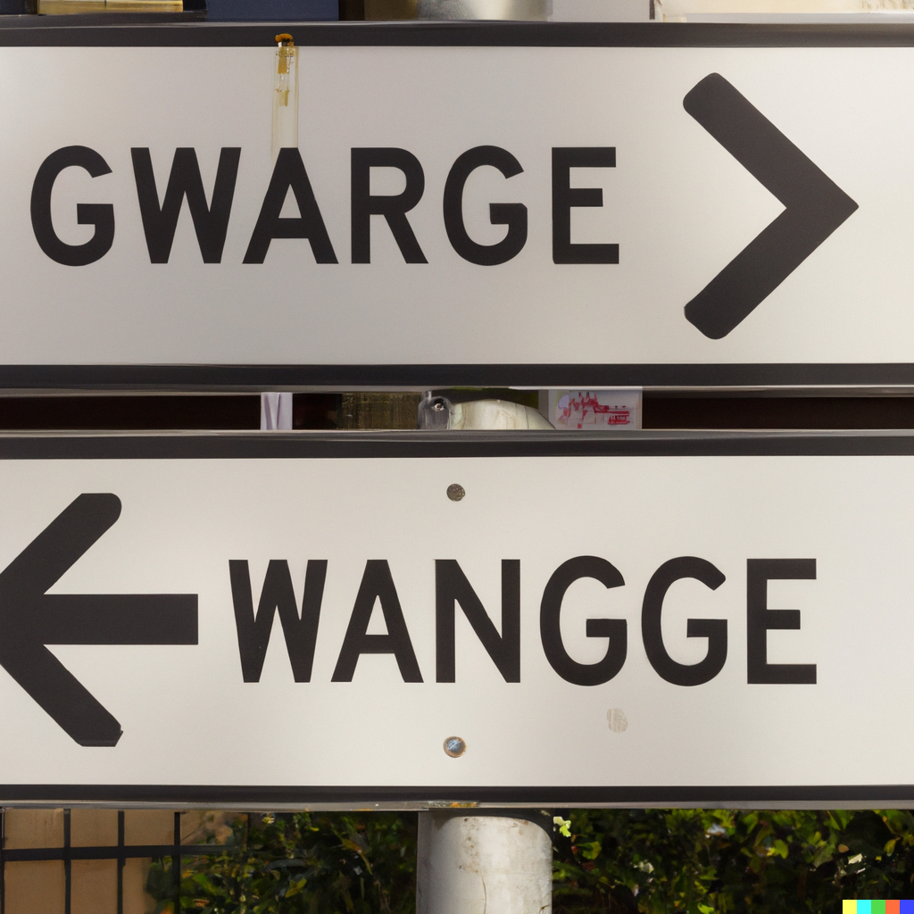

**When we do not know where to go**, we follow the signs. Sometimes, this is simple, because there is one direction we can go.

.png)

But when there are multiple directions to go, it gets more complicated. 

